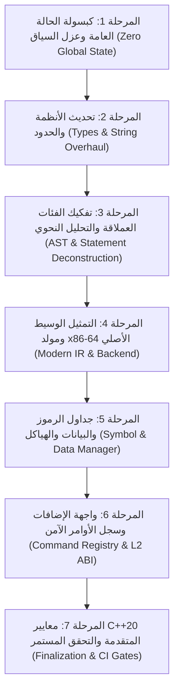

# DarkBasic Pro Compiler: Architectural Modernization Roadmap (C++20 / Pure x64)

> **خطة التحديث المعماري الشاملة ومسار التنفيذ المرحلي:** خارطة طريق تفصيلية من 7 مراحل متتالية ومرتبة منطقياً لإزالة كافة آثار الليجاسي و 32-بت، وتحويل الكومبايلر بالكامل إلى C++20 معمارية حديثة، آمنة، ونقية بنسبة 100%.

---

## 🗺️ المخطط العام للمراحل والتبعيات (Roadmap Pipeline)

---

## 📅 تفاصيل المراحل التنفيذية

### 🔹 المرحلة 1: كبسولة الحالة العامة وعزل السياق (Zero Global State & Context Encapsulation)
* **الهدف:** إزالة كافة المتغيرات العامة (`extern ... g_p...`) وجعل جلسة الترجمة مستقلة وآمنة الخيوط (Thread-Safe & Reentrant).
* **الملفات المستهدفة:**
  - [`CompilerContext.h`](file:///d:/GitHub-repo/FPC%20Creator%20Repos/Dark-Basic-Pro/DBProCompiler/DBPCompiler/CompilerContext.h) / [`CompilerContext.cpp`](file:///d:/GitHub-repo/FPC%20Creator%20Repos/Dark-Basic-Pro/DBProCompiler/DBPCompiler/CompilerContext.cpp)
  - [`DBPCompiler.h`](file:///d:/GitHub-repo/FPC%20Creator%20Repos/Dark-Basic-Pro/DBProCompiler/DBPCompiler/DBPCompiler.h) / [`DBPCompiler.cpp`](file:///d:/GitHub-repo/FPC%20Creator%20Repos/Dark-Basic-Pro/DBProCompiler/DBPCompiler/DBPCompiler.cpp)
  - [`Main.cpp`](file:///d:/GitHub-repo/FPC%20Creator%20Repos/Dark-Basic-Pro/DBProCompiler/DBPCompiler/Main.cpp)
* **خطوات التنفيذ:**
  1. تمرير مرجع كائن `CompilerContext&` إلى كافة المحللات والمولدات بدلاً من استدعاء `g_p...`.
  2. تحويل ملكية الجداول (`pVarTable`, `pDataTable`, `pLabelTable`, `pStructTable`) إلى `std::unique_ptr` مملوكة لـ `CompilerContext`.
  3. حظر أي متغير عام غير ثابت (`mutable global`) عبر فحص static analysis / clang-tidy.
* **معيار النجاح والاختبار:** بناء الكومبايلر وإجراء ترجمة متزامنة لملفين في خيطين مختلفين (`std::jthread`) دون تداخل بيانات.

---

### 🔹 المرحلة 2: تحديث الأنظمة والحدود والسلاسل (Types & String Overhaul)
* **الهدف:** القضاء على الكلاس القديم `CStr` واستبدال `DWORD` و `LPSTR` بأنواع C++20 القياسية.
* **الملفات المستهدفة:**
  - [`Str.h`](file:///d:/GitHub-repo/FPC%20Creator%20Repos/Dark-Basic-Pro/DBProCompiler/DBPCompiler/Str.h) / [`Str.cpp`](file:///d:/GitHub-repo/FPC%20Creator%20Repos/Dark-Basic-Pro/DBProCompiler/DBPCompiler/Str.cpp)
  - [`StringUtils.h`](file:///d:/GitHub-repo/FPC%20Creator%20Repos/Dark-Basic-Pro/DBProCompiler/DBPCompiler/StringUtils.h)
  - [`BinaryCodec.h`](file:///d:/GitHub-repo/FPC%20Creator%20Repos/Dark-Basic-Pro/DBProCompiler/DBPCompiler/BinaryCodec.h)
* **خطوات التنفيذ:**
  1. تحويل واجهات قراءة النصوص إلى `std::string_view` (Zero-copy).
  2. تحويل دوال تجميع النصوص إلى `std::string` أو دوال مساعدة في `dbp::string_utils`.
  3. استبدال `DWORD` في العنونة والقياسات بـ `std::size_t` و `std::uintptr_t` وفي الأعداد ذات الحجم الثابت بـ `std::uint32_t` / `std::uint64_t`.
  4. حذف كلاس `CStr` القديم بالكامل بمجرد استبدال كافة استدعاءاته.
* **معيار النجاح والاختبار:** اجتياز اختبارات النصوص والتوافق اللغوي (`test_expression_parser.cpp` و `run-conformance.Tests.ps1`).

---

### 🔹 المرحلة 3: تفكيك الفئات العملاقة والتحليل النحوي (AST & Statement Deconstruction)
* **الهدف:** تفكيك ملف [`Statement.cpp`](file:///d:/GitHub-repo/FPC%20Creator%20Repos/Dark-Basic-Pro/DBProCompiler/DBPCompiler/Statement.cpp) (5,258 سطر) وتحويله إلى خط إنتاج AST حقيقي.
* **الملفات المستهدفة:**
  - [`Statement.cpp`](file:///d:/GitHub-repo/FPC%20Creator%20Repos/Dark-Basic-Pro/DBProCompiler/DBPCompiler/Statement.cpp) / [`Statement.h`](file:///d:/GitHub-repo/FPC%20Creator%20Repos/Dark-Basic-Pro/DBProCompiler/DBPCompiler/Statement.h)
  - [`StatementList.cpp`](file:///d:/GitHub-repo/FPC%20Creator%20Repos/Dark-Basic-Pro/DBProCompiler/DBPCompiler/StatementList.cpp) / [`StatementList.h`](file:///d:/GitHub-repo/FPC%20Creator%20Repos/Dark-Basic-Pro/DBProCompiler/DBPCompiler/StatementList.h)
  - `Parse*.cpp` (`ParseInstruction.cpp`, `ParseUserFunction.cpp`, إلخ)
  - [`ASTNodes.h`](file:///d:/GitHub-repo/FPC%20Creator%20Repos/Dark-Basic-Pro/DBProCompiler/DBPCompiler/ASTNodes.h) / [`SemanticVisitor.cpp`](file:///d:/GitHub-repo/FPC%20Creator%20Repos/Dark-Basic-Pro/DBProCompiler/DBPCompiler/SemanticVisitor.cpp)
* **خطوات التنفيذ:**
  1. إلغاء بنية القوائم المرتبطة بمؤشرات خام (`m_pNext`) واستبدالها بحاوية `std::vector<std::unique_ptr<ASTStatementNode>>`.
  2. فصل مسؤولية المعالجة اللفظية والنحوية: نقل محللات الحلقات والدوال والجمل الشرطية إلى محولات مستقلة ترث من نمط موحد.
  3. تفعيل خط التحقق الدلالي (`SemanticVisitor`) والتحسين الثابت (`ASTOptimizer`).
* **معيار النجاح والاختبار:** عدم وجود أي `delete` يدوي في طبقة التحليل واجتياز اختبارات `test_ast.cpp`.

---

### 🔹 المرحلة 4: التمثيل الوسيط ومولد x86-64 الأصلي (Modern IR & Backend)
* **الهدف:** تفكيك [`ASMWriter.cpp`](file:///d:/GitHub-repo/FPC%20Creator%20Repos/Dark-Basic-Pro/DBProCompiler/DBPCompiler/ASMWriter.cpp) (2,997 سطر) والتخلص من جداول الـ x86 القديمة لصالح مولد x64 نقي وآمن.
* **الملفات المستهدفة:**
  - [`ASMWriter.cpp`](file:///d:/GitHub-repo/FPC%20Creator%20Repos/Dark-Basic-Pro/DBProCompiler/DBPCompiler/ASMWriter.cpp) / [`ASMWriter.h`](file:///d:/GitHub-repo/FPC%20Creator%20Repos/Dark-Basic-Pro/DBProCompiler/DBPCompiler/ASMWriter.h)
  - [`IRLoweringVisitor.cpp`](file:///d:/GitHub-repo/FPC%20Creator%20Repos/Dark-Basic-Pro/DBProCompiler/DBPCompiler/IRLoweringVisitor.cpp) / [`TargetCodegen.cpp`](file:///d:/GitHub-repo/FPC%20Creator%20Repos/Dark-Basic-Pro/DBProCompiler/DBPCompiler/TargetCodegen.cpp)
  - [`MachineCodeBuffer.cpp`](file:///d:/GitHub-repo/FPC%20Creator%20Repos/Dark-Basic-Pro/DBProCompiler/DBPCompiler/MachineCodeBuffer.cpp)
* **خطوات التنفيذ:**
  1. التخلص من مصفوفات الأوبكود الثابتة (`m_iASMPreOp[300]`).
  2. بناء فئة `X64InstructionEmitter` متخصصة تدعم توليد صيغ الأوامر بمحددات واضحة (`RexW`, `ModRM`, `SIB`, `Immediate`, `Displacement`).
  3. تنفيذ بروتوكول استدعاء الدوال الرسمي لنظام ويندوز 64-بت (**Windows x64 Calling Convention**):
     - تمرير أول 4 معاملات في `RCX, RDX, R8, R9` (أو `XMM0-XMM3`).
     - حجز مساحة الظل الإلزامية (`32 bytes shadow space`).
     - ضبط محاذاة المكدس عند حدود 16 بايت قبل كل نداء (`CALL`).
  4. توليد معلومات استرجاع المكدس (Unwind Info / `.pdata` و `.xdata`) لضمان تكامل الـ Exception Handling.
* **معيار النجاح والاختبار:** تشغيل اختبار `test_e2e_x64_compilation.cpp` ونجاح توليد وتنفيذ برامج Basic كاملة عبر الـ JIT الداخلي.

---

### 🔹 المرحلة 5: جداول الرموز والبيانات والهياكل (Symbol & Data Manager)
* **الهدف:** إعادة كتابة جداول البيانات والرموز وتوزيع الذاكرة باستخدام حاويات STL القياسية وعنونة 64-بت الحقيقية.
* **الملفات المستهدفة:**
  - [`VarTable.cpp`](file:///d:/GitHub-repo/FPC%20Creator%20Repos/Dark-Basic-Pro/DBProCompiler/DBPCompiler/VarTable.cpp) / [`VarTable.h`](file:///d:/GitHub-repo/FPC%20Creator%20Repos/Dark-Basic-Pro/DBProCompiler/DBPCompiler/VarTable.h)
  - [`DataTable.cpp`](file:///d:/GitHub-repo/FPC%20Creator%20Repos/Dark-Basic-Pro/DBProCompiler/DBPCompiler/DataTable.cpp) / [`DataTable.h`](file:///d:/GitHub-repo/FPC%20Creator%20Repos/Dark-Basic-Pro/DBProCompiler/DBPCompiler/DataTable.h)
  - [`StructTable.cpp`](file:///d:/GitHub-repo/FPC%20Creator%20Repos/Dark-Basic-Pro/DBProCompiler/DBPCompiler/StructTable.cpp) / [`StructTable.h`](file:///d:/GitHub-repo/FPC%20Creator%20Repos/Dark-Basic-Pro/DBProCompiler/DBPCompiler/StructTable.h)
  - [`LabelTable.cpp`](file:///d:/GitHub-repo/FPC%20Creator%20Repos/Dark-Basic-Pro/DBProCompiler/DBPCompiler/LabelTable.cpp) / [`LabelTable.h`](file:///d:/GitHub-repo/FPC%20Creator%20Repos/Dark-Basic-Pro/DBProCompiler/DBPCompiler/LabelTable.h)
* **خطوات التنفيذ:**
  1. استبدال مصفوفات `new T[size]` ومضاعفة الذاكرة يدوياً بـ `std::vector<SymbolEntry>`.
  2. استخدام قواميس بحث حديثة `std::unordered_map` مع بحث سريع بالنصوص (`std::string_view` lookup).
  3. محاذاة حقول الـ UDTs (User-Defined Types) وفق معايير 64-بت (8-byte alignment) ومنع أي قطع للعناوين.
* **معيار النجاح والاختبار:** اختبارات هياكل البيانات والمصفوفات متعددة الأبعاد (`test_exeblock_arrays.cpp` و `test_struct_table.cpp`).

---

### 🔹 المرحلة 6: واجهة الإضافات وسجل الأوامر الآمن (Command Registry & L2 ABI)
* **الهدف:** استبدال ملفات الموارد `.rc` وجداول الأسماء المزخرفة (Decorated Names) بسجل أوامر منمط وثابت.
* **الملفات المستهدفة:**
  - [`L2_MODERNIZATION_PLAN.md`](file:///d:/GitHub-repo/FPC%20Creator%20Repos/Dark-Basic-Pro/L2_MODERNIZATION_PLAN.md)
  - مكتبات `Dark Basic Pro SDK` و `Official Plugins`
  - [`PluginRegistry.h`](file:///d:/GitHub-repo/FPC%20Creator%20Repos/Dark-Basic-Pro/DBProCompiler/DBPCompiler/PluginRegistry.h)
* **خطوات التنفيذ:**
  1. بناء كلاس `CommandRegistry` يسجل دوال الأوامر مباشرة عبر مؤشرات دوال نمطية `std::function` / `extern "C"`.
  2. بناء محول قيم موحد `ValueAdaptor` لتحويل قيم المفسر إلى `std::string_view` و `std::span` دون تهريب مؤشرات داخل فتحات `DWORD`.
  3. توحيد واجهة تصدير الإضافات الخارجية (`IPlugin* CreatePlugin(uint32_t abi_version)`).
* **معيار النجاح والاختبار:** إلغاء الاعتماد على قراءة ملفات `.rc` عند وقت التشغيل مع بقاء جميع أوامر المستخدم تعمل بسلاسة.

---

### 🔹 المرحلة 7: معايير C++20 المتقدمة والتحقق المستمر (Finalization & CI Gates)
* **الهدف:** إقفال دورة التحديث بالكامل وتطبيق أدوات الفحص الصارم ضد أي انحدار (Zero-Regression Policy).
* **الملفات المستهدفة:**
  - كافة ملفات المشروع
  - `.clang-tidy` و `CMakeLists.txt` و `CMakePresets.json`
* **خطوات التنفيذ:**
  1. تفعيل فحص `clang-tidy` الصارم (enforce `modernize-*`, `bugprone-*`, `cppcoreguidelines-*`) كبوابة إلزامية للبناء.
  2. تشغيل فاحصات الذاكرة والسلوك غير المعرف (`ASan` و `UBSan`) على كامل حزمة الاختبارات التلقائية.
  3. اعتماد `std::expected` / `std::optional` كنمط موحد لإرجاع الأخطاء بدلاً من الأكواد الرقمية السحرية.
* **معيار النجاح والاختبار:** بناء نظيف بدون أي تحذير (`0 warnings`) واجتياز CTest بنسبة 100% تحت أدوات التعقيم (ASan/UBSan).

---

## 📊 جدول المتابعة والتقدم (Implementation Checklist)

- [ ] **المرحلة 1: كبسولة الحالة العامة وعزل السياق (Zero Global State)**
- [ ] **المرحلة 2: تحديث الأنظمة والحدود والسلاسل (Types & String Overhaul)**
- [ ] **المرحلة 3: تفكيك الفئات العملاقة والتحليل النحوي (AST & Statement Deconstruction)**
- [ ] **المرحلة 4: التمثيل الوسيط ومولد x86-64 الأصلي (Modern IR & Backend)**
- [ ] **المرحلة 5: جداول الرموز والبيانات والهياكل (Symbol & Data Manager)**
- [ ] **المرحلة 6: واجهة الإضافات وسجل الأوامر الآمن (Command Registry & L2 ABI)**
- [ ] **المرحلة 7: معايير C++20 المتقدمة والتحقق المستمر (Finalization & CI Gates)**
